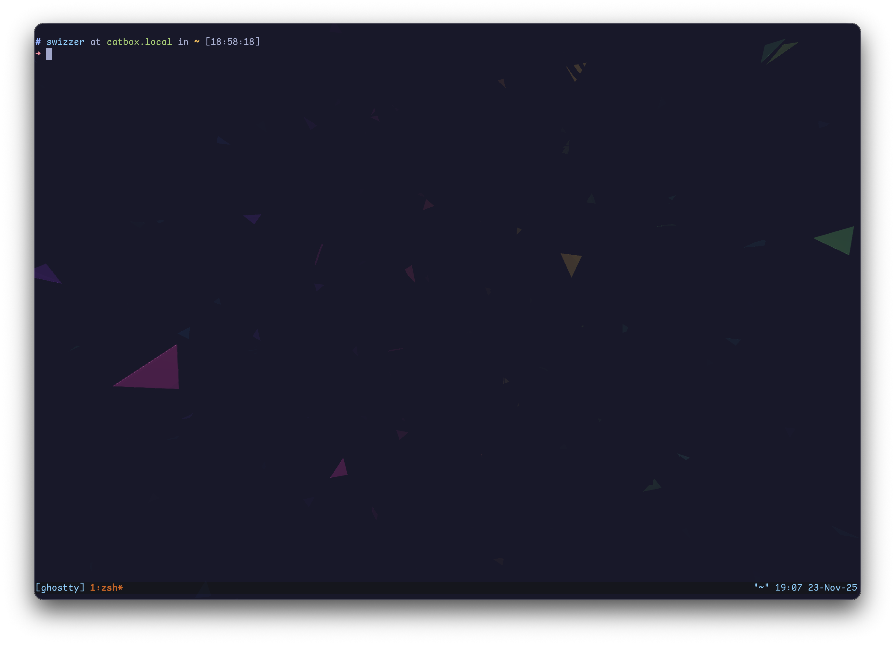

# MY [Ghostty](https://ghostty.org/) shader

Add some intersting visual effects in your terminal😋

## Usage

- Copy `pjsk.glsl` to `~/.config/ghostty/shaders/pjsk.glsl`
- Write `custom-shader = ~/.config/ghostty/shaders/pjsk.glsl` line in your Ghostty config

## Example

